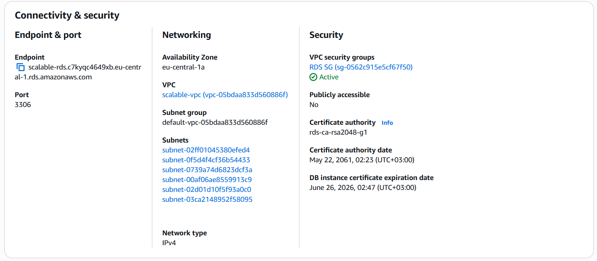
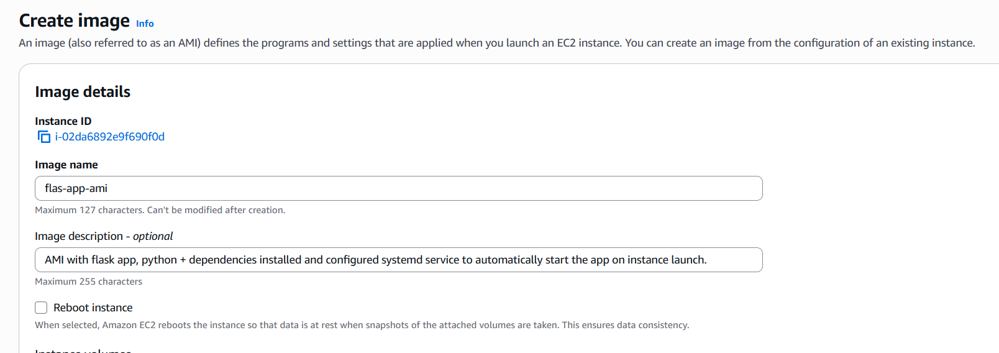
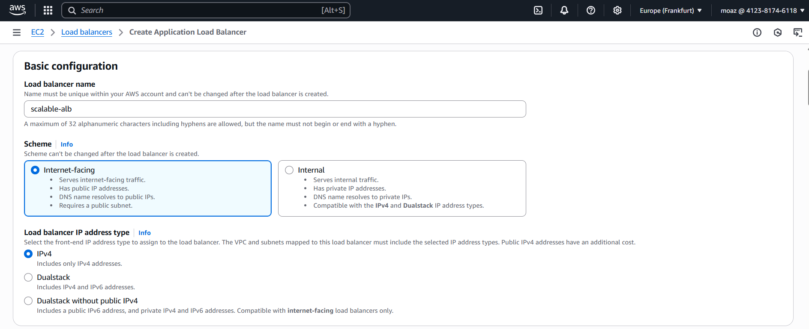
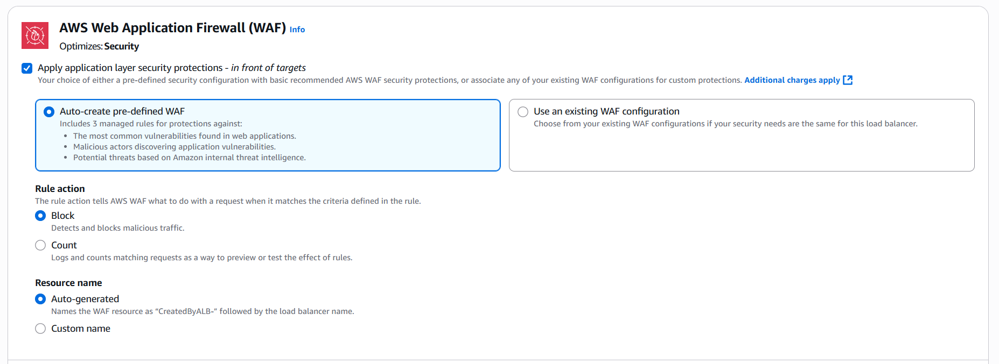
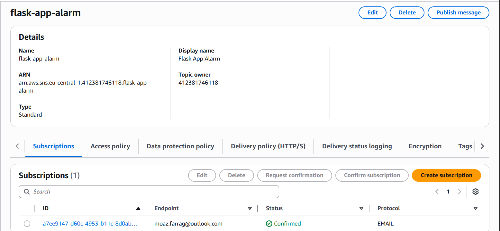

# Scalable, Highly Available and Secure AWS Architecture

This project builds a scalable, highly available and secure AWS architecture designed for hosting web applications with fault tolerance, monitoring, and automation. It utilizes various AWS services such as VPC, EC2, RDS, ALB, Auto Scaling, WAF, SNS and more to create a robust infrastructure. 

--- 

## 🌐 Architecture Overview
The infrastructure is deployed in a single VPC spanning  **two Availability Zones (AZs)** within the **AWS Region`Frankfurt (eu-central-1)`** to ensure high availability and fault tolerance.

It includes public subnets (for ALB, NAT Gateway, Bastion Host) and private subnets (for EC2 Auto Scaling instances and RDS).
Traffic flows securely from the ALB to private EC2 instances, with outbound internet access via the NAT Gateway.

---

## 🧩 Key Components

### 1. **Route 53**
- Acts as the DNS service to route user traffic to the Application Load Balancer (ALB).
- Supports routing policies like weighted, latency, and failover.

### 2. **AWS WAF (Web Application Firewall)**
- Additional protection against commmon web attacks.
- Attached to the ALB for filtering and blocking malicious traffic.

### 3. **Internet Gateway (IGW)**
- Provides internet access to public subnets.
- Allows users to reach the ALB and Bastion Host.

### 4. **Application Load Balancer (ALB)**
- Public-facing ALB distributes incoming web traffic to backend EC2 instances.
- Supports path-based routing and health checks.

### 5. **IAM Roles and Policies**
- Secure access control for EC2, RDS, and monitoring services.
- Ensures least-privilege principle for automation and user access.

### 6. **Public Subnets**
- **Bastion Host** (for secure SSH access to private EC2s)
- **NAT Gateway** (to enable outbound internet access for EC2s in private subnets)

### 7. **Private Subnets**
- **Web Servers** (EC2 instances in Auto Scaling group)
- **Amazon RDS** (primary and standby database instances)

### 8. **Auto Scaling Group**
- Ensures scalability and high availability of web servers.
- Automatically adjusts the number of EC2 instances based on demand.

### 9. **Amazon RDS (with Multi-AZ)**
- Provides a managed relational database with automatic failover.
- **Primary DB instance** and **Standby instance** are in separate AZs for HA.
  
### 10. **AWS Secrets Manager**
- Securely stores and manages sensitive information like database credentials.

### 11. **CloudWatch & SNS**
- **CloudWatch** monitors metrics and triggers alarms on failures or performance issues.
- **SNS** sends notifications (email alerts) to DevOps engineers upon alarm triggers.

---

## 🎯 Implementation Steps using AWS Management Console

### 1️⃣ Networking Setup
- Created a custom VPC across two Availability Zones.
- Created **public subnets** for ALB, NAT Gateway, and Bastion Host.
- Created **private subnets** for EC2 app servers and RDS database.
- Attached an **Internet Gateway (IGW)** to the VPC for external connectivity.
- Created a **NAT Gateway** in a public subnet to enable private EC2 instances to access the internet securely.
- Configured route tables to ensure proper traffic flow between components.

---

### 2️⃣ Security Setup
- Created security groups:
  - **ALB SG**: allows inbound HTTP (port 80) from the internet.
  - **EC2 SG**: allows HTTP only from ALB SG.
  - **RDS SG**: allows MySQL (port 3306) only from EC2 SG.
  - **Bastion SG**: allows SSH (port 22) from trusted IPs.
- Created an **IAM role** for EC2 instances to access AWS Secrets Manager for DB credentials.

---

### 3️⃣ Database Setup
- Deployed an **Amazon RDS MySQL (Multi-AZ)** instance in private subnets.

- Attached **RDS SG** to allow access from EC2 instances.
- Stored RDS credentials securely in **AWS Secrets Manager**.

---

### 4️⃣ App Server Preparation
- Launched a temporary EC2 instance in a private subnet.
- Installed Flask app, Gunicorn, and configured `systemd` service for auto-start on boot.
- Configured the app to retrieve database credentials from **AWS Secrets Manager**.
- Tested the app locally on port 80.
- Created an **AMI** from this EC2 instance to be used in **ASG Launch Template**.

---

### 5️⃣ Auto Scaling + ALB
- Created a **Launch Template** using the custom **AMI**.
- Configured the template with:
  - Instance type: `t3.micro`
  - Security group: **EC2 SG**
  - Key pair for SSH access from the Bastion Host.
- Set up an **Auto Scaling Group (ASG)** using this template, with private subnets.
- Target Scaling Policy to scale out/in based on average CPU utilization (target 70%).

- Deployed an **Application Load Balancer (ALB)** in public subnets across two AZs.
- Configured ALB with:
  - HTTP listener on port 80.
  - Target group linked to the ASG.
  - Health checks on `/` to monitor instance health.
  
  
  

---

### 6️⃣ Security Hardening
- Attached **AWS WAF** to ALB with rules to block common web attacks (SQL injection, XSS).

---

### 7️⃣ Bastion Host
- Deployed a **Bastion Host** in a public subnet for secure SSH access to private EC2 instances.

---

### 8️⃣ Monitoring + Notifications
- Configured **CloudWatch alarm** to trigger when the ALB has unhealthy hosts.

- Set up an **SNS topic** and subscribed an email address for receiving alerts.

- Configured the alarm to send notifications to the SNS topic when triggered.

---

## 🔐 Security Considerations

- Web servers are in private subnets — not directly accessible from the internet.
- SSH access is restricted via a **Bastion Host** in a public subnet.
- **Security Groups** are configured to allow traffic only from trusted sources.
- **IAM roles** applied to control access to AWS services with least-privilege permissions.
- **AWS WAF** provides an additional layer of security against common web attacks.
- **AWS Secrets Manager** is used to securely store and manage database credentials.
  
---

